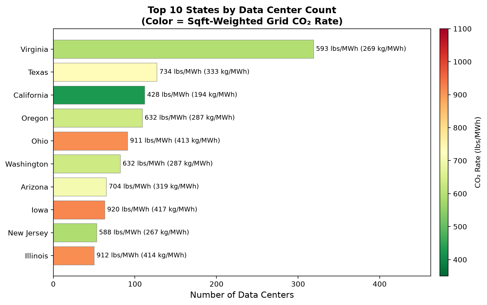
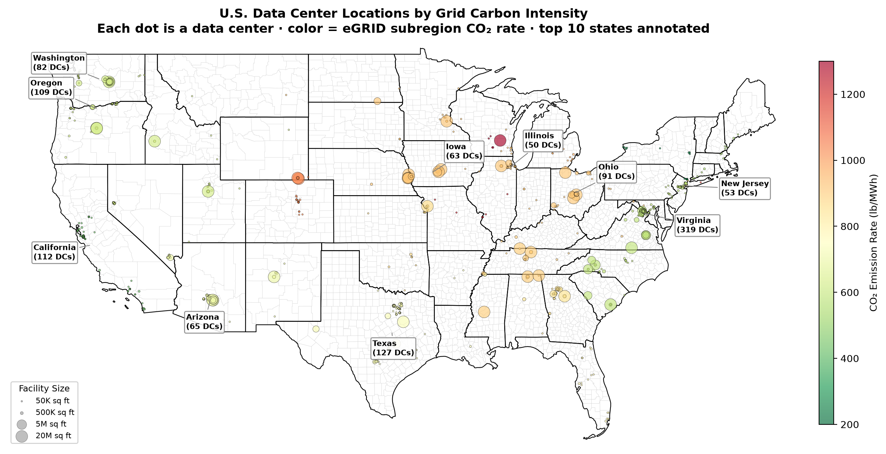
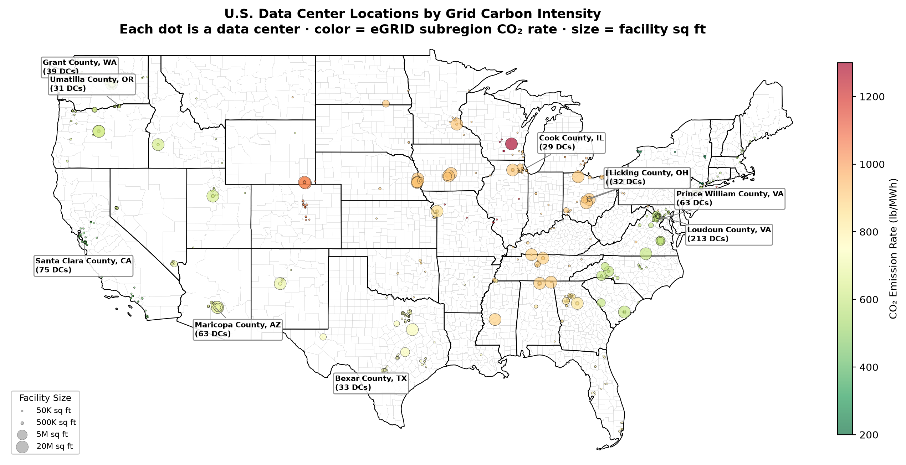
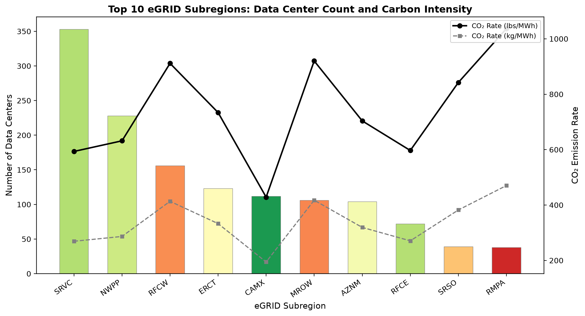
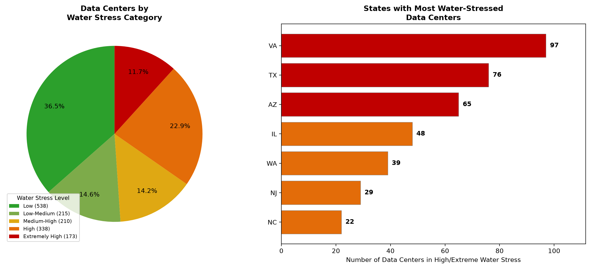
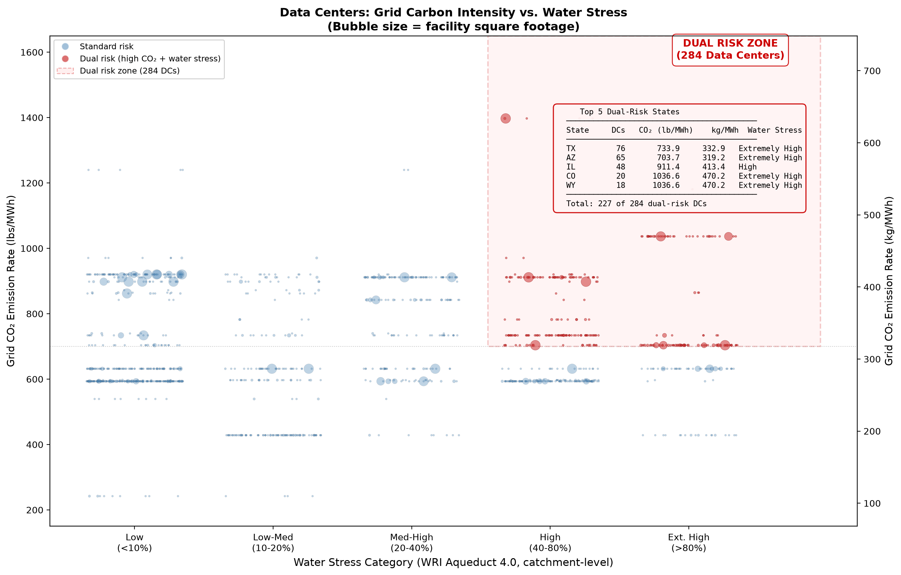

**Final Project Repo:** [Datacenter Sustainability Analysis](https://github.com/ankitdixit23/AI-datacenter-sustainability-analysis) 

 **Final Dashboard:** [Datacenter Sustainability Streamlit.app](https://dc-sustainability.streamlit.app/)

***Introduction and Research Questions:***

The rapid expansion of artificial intelligence and cloud computing has significantly increased data center construction across the United States. These facilities consume substantial electricity and water for cooling, raising concerns about their ecological sustainability. This report asks: ***How are the locations of AI and cloud data centers in the United States associated with the local carbon intensity of electricity grids and regional water stress, and what are the policy ramifications for sustainable data center siting?*** We explore three sub-questions: (1) which U.S. counties/states have the highest data center concentration and what is their grid carbon intensity; (2) are data centers disproportionately located in water-stressed zones; and (3) under projected growth scenarios, how might future siting exacerbate or mitigate these pressures.

**Project Motivation**

India's 2026 Union Budget introduced a 21-year tax holiday for foreign cloud providers, catalyzing over $200 billion in announced data center investments, yet this expansion sits on a grid emitting roughly double the U.S. average carbon intensity (0.703 kg CO₂/kWh) in a country holding 18% of the world's population but only 4% of its freshwater. The spatial methodology developed in this U.S.-focused analysis, linking facility locations to grid carbon intensity and watershed-level water stress, is directly transferable to evaluating whether India's incentive regime steers growth toward sustainable corridors or entrenches infrastructure where carbon and water costs compound for decades. We intend to pursue this India application as our next data visualization project over the summer.

***Project Analysis: Key Insights***

**Data Collection and Processing Pipeline**

This analysis integrates three publicly available datasets: the IM3 Open Source Data Center Atlas (PNNL/DOE, 1,479 facility-level records with coordinates, operator, and square footage), the EPA's Emissions & Generation Resource Integrated Database (eGRID 2023, plant/subregion/state-level CO₂ rates and fuel mix), and the WRI Aqueduct 4.0 Water Risk Atlas (catchment-level water stress scores and future projections through 2080). A `download_data.py` script automates retrieval into `data/raw-data/`. All wrangling is consolidated in `preprocessing.py`, which deduplicates five cross-county facility IDs to yield 1,474 unique data centers, generates FIPS codes, and outputs seven derived CSVs to `data/derived-data/`.

For carbon intensity (Sub-Question 1), the pipeline assigns each data center the EPA grid subregion of its geographically nearest power plant via a nearest-neighbor spatial index, then merges subregion-level CO₂ rates in lbs/MWh onto facility records. For water stress (Sub-Question 2), a point-in-polygon spatial join against the WRI Aqueduct 4.0 baseline layer assigns each facility its enclosing watershed's stress score (Low through Extremely High); future projections for 2030–2080 are extracted separately. A final master merge combines both layers into a single facility-level record enabling the dual-risk analysis.

**Visualization Outputs and Key Findings**

The chart generation script (`code/generate_charts.py`) produces six static figures from the derived data; the Streamlit dashboard pages provide interactive equivalents.

Figure 1 ranks the top 10 states by data center count, with bar color encoding mean grid CO₂ rate and dual-unit labels. Virginia leads with 319 facilities at 594 lbs/MWh (270 kg/MWh). Ohio (911), Iowa (920), and Illinois (925 lbs/MWh) are high-carbon hotspots, each roughly 30% above the national average, while California benefits from the cleanest grid at 428 lbs/MWh, roughly 40% below.

{width=55%}

Figures 2a–2b are spatial maps plotting each data center colored by grid subregion CO₂ rate and sized by facility square footage (larger circles = larger buildings). The Northern Virginia mega-cluster (319 DCs), the Pacific Northwest corridor (OR 109, WA 82), and Midwest markers at Columbus, OH (65 DCs) and Chicago, IL (29 DCs) on grids exceeding 900 lbs/MWh are immediately visible.

{width=48%} {width=48%}

Figure 3 compares the top 10 EPA grid subregions. The Virginia/Carolina subregion (SRVC) hosts ~347 data centers at ~594 lbs/MWh; the RFC West region covering Ohio and the Midwest (RFCW) hosts ~156 on one of the dirtiest grids at ~911 lbs/MWh. The Rocky Mountain subregion (RMPA) registers the highest rate at over 1,036 lbs/MWh, nearly 50% above average. Figure 4 shows 66.3% of data centers fall in Low-Medium water stress, but 26.7% (393 facilities) are in High or Extremely High zones, led by Texas (127), California (112), and Arizona (65).

{width=48%} {width=48%}

Figure 5 is the central output: a dual-axis scatter of every data center by water stress (x) and grid CO₂ rate (y), with bubble size encoding square footage. The shaded red zone identifies 250 dual-risk facilities on grids above 700 lbs/MWh in High or Extremely High water stress catchments, concentrated in TX, AZ, NV, CO, and NM. Colorado's Rocky Mountain grid at 1,036.6 lbs/MWh (470.2 kg/MWh) in severely stressed watersheds represents the most environmentally costly computing corridor in the country.

{width=65%}

The interactive Streamlit dashboard ([dc-sustainability.streamlit.app](https://dc-sustainability.streamlit.app/)) extends these findings into a four-page explorer with filters for state, operator, carbon intensity, and water stress, plus Aqueduct future projections under BAU, optimistic, and pessimistic scenarios. The 250 dual-risk facilities identified across these outputs motivate the following policy interventions.

***Policy Implications***

**1. Grid-aware siting incentives.** Nearly 30% of U.S. data centers operate on grids above 800 lbs CO₂/MWh, primarily in Ohio and the Midwest. Federal or state tax credits tied to grid carbon intensity could steer new construction toward cleaner regions such as the Pacific Northwest (632 lbs/MWh, 55% renewables) or California (428 lbs/MWh, 47% renewables), cutting per-facility emissions by up to half.

**2. Water-impact assessments for permitting.** With 393 facilities in High or Extremely High water stress zones and 250 facing dual carbon-water risk, states such as Texas, Arizona, Colorado, and Nevada should require water-impact assessments in data center permitting, including minimum water-use efficiency standards and withdrawal caps in overstressed watersheds.

**3. Climate-informed long-term siting.** Data centers have 20-to-30-year lifespans, yet Aqueduct projections show Extremely High water stress catchments increasing 7.4% by 2080 under business-as-usual. Siting models should incorporate climate projections, favoring regions with stable water outlooks (Pacific Northwest, Upper Midwest, New England) over areas facing compounding stress (desert Southwest, Southern Plains).

**4. Transferability to emerging markets.** The spatial framework linking facilities to grid intensity and watershed stress is directly applicable to India's $200 billion data center buildout on a grid at double the U.S. average carbon intensity with only 4% of global freshwater, providing a template for environmental due diligence in siting decisions worldwide.

***Conclusion***

As AI workloads increase demand for new data center capacity, siting decisions in the coming decade will shape the industry’s environmental legacy for years to come. The evidence suggests that targeted policies, including grid-aware tax incentives, water-impact assessments, and climate-informed siting guidelines, could substantially reduce the environmental burden of this critical infrastructure without limiting industry growth. The spatial analysis framework developed here offers a replicable model for evaluating sustainability trade-offs in data center siting, both within the U.S. and in emerging markets like India, where the stakes of environmentally responsible growth are even higher.